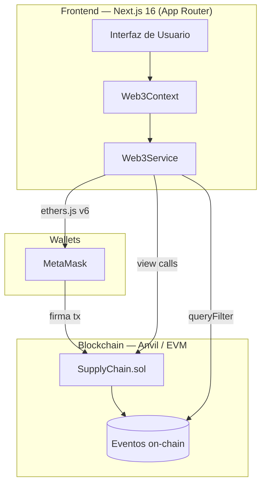
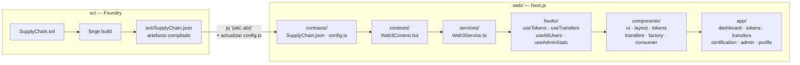
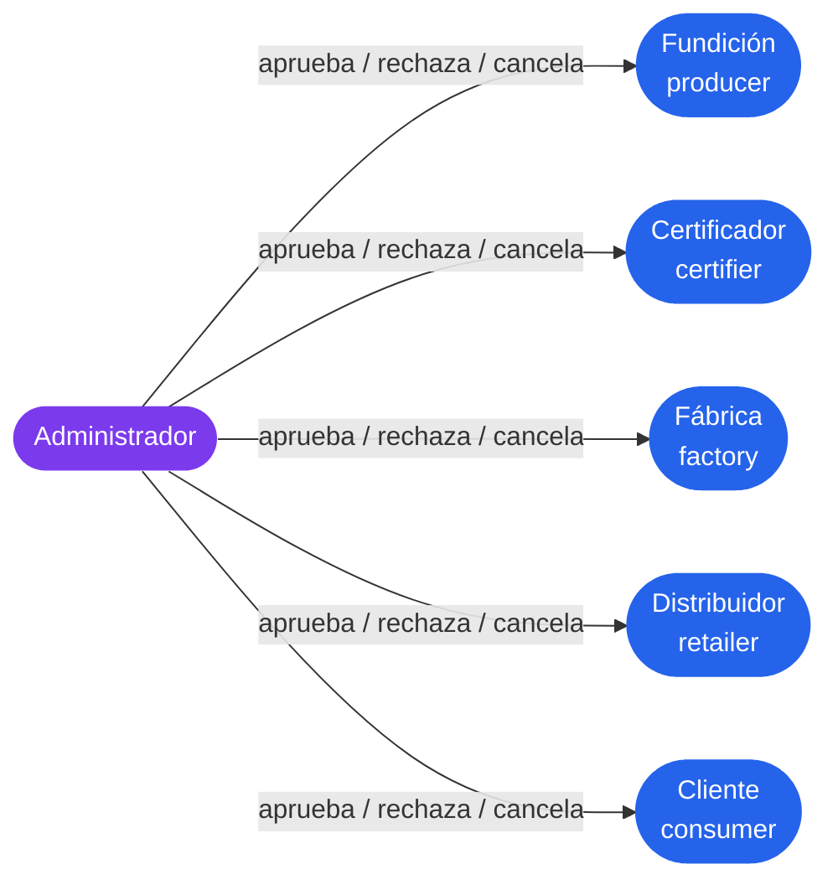
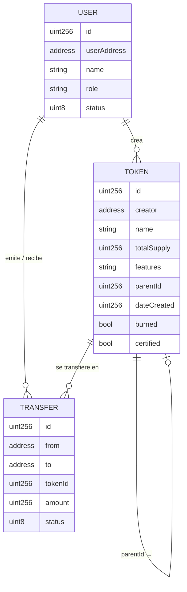
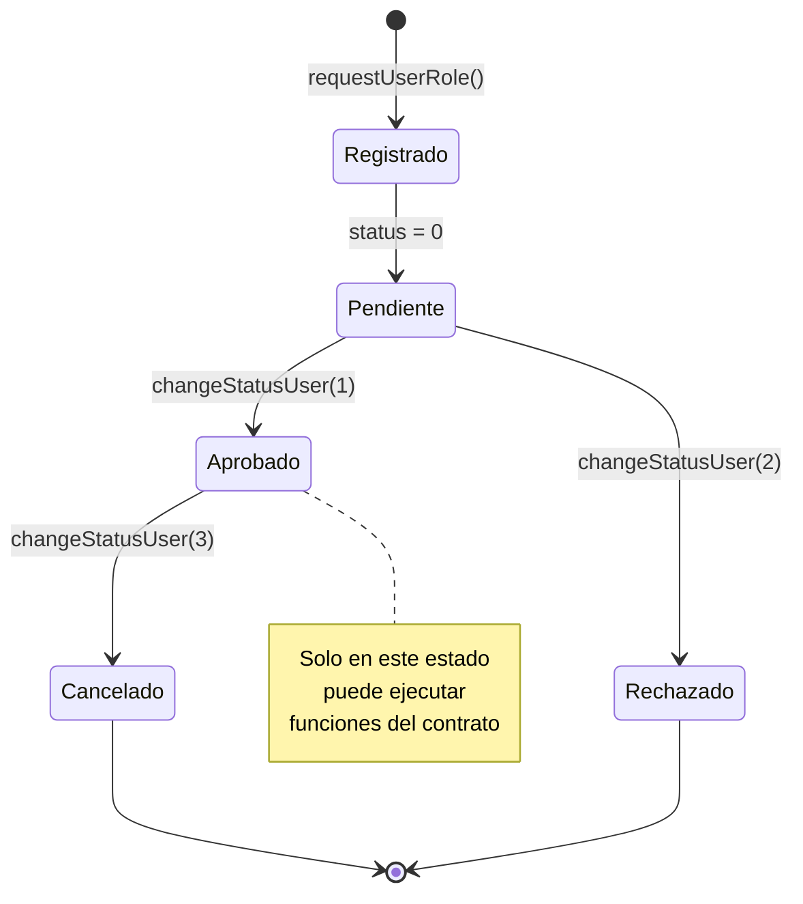
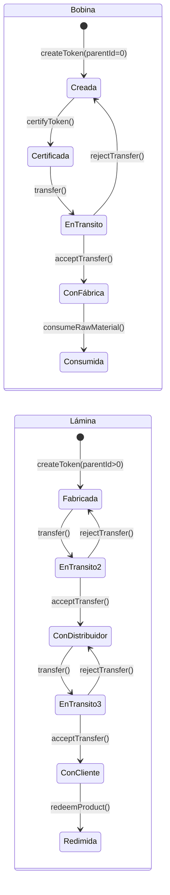
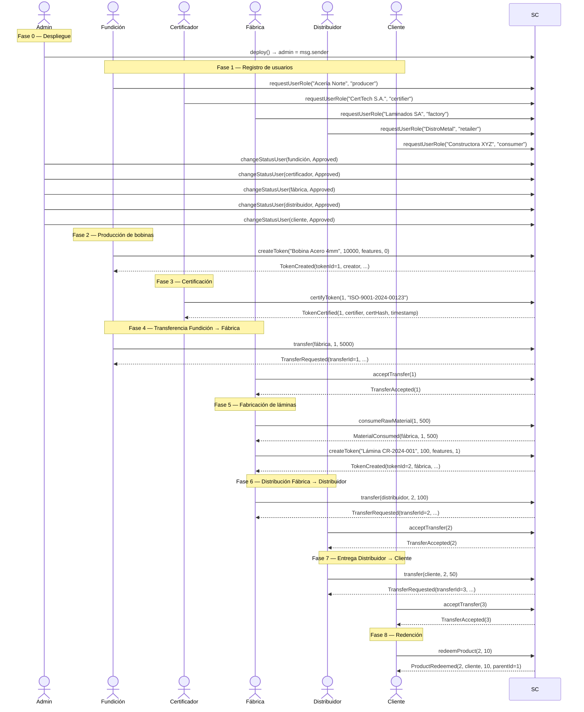
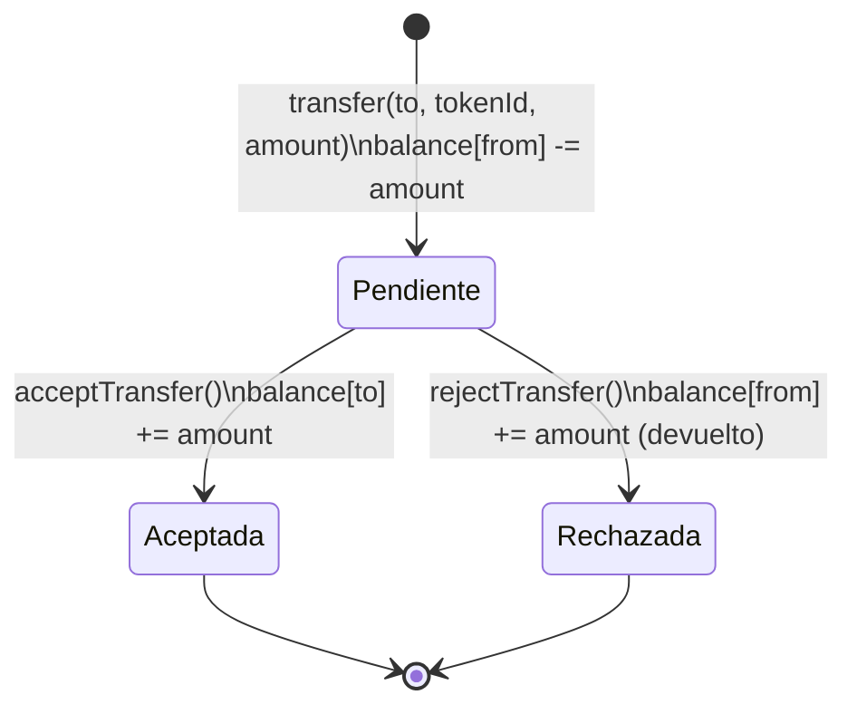
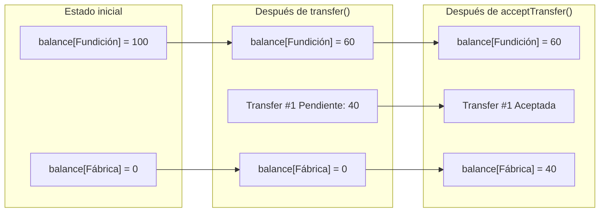

# Metal Trace — Modelo Teórico del Sistema

**Proyecto:** Metal Trace — Trazabilidad Blockchain para Cadena de Suministro Industrial  
**Contrato:** `SupplyChain.sol` (Solidity ^0.8.19)  
**Red objetivo:** EVM-compatible (desarrollo en Anvil local, chainId 31337)  
**Versión del documento:** 1.0

---

## Índice

1. [Visión General](#1-visión-general)
2. [Arquitectura del Sistema](#2-arquitectura-del-sistema)
   - [Estructura de Archivos del Proyecto](#estructura-de-archivos-del-proyecto)
3. [Roles y Permisos](#3-roles-y-permisos)
4. [Estructuras de Datos](#4-estructuras-de-datos)
5. [Ciclo de Vida del Usuario](#5-ciclo-de-vida-del-usuario)
6. [Ciclo de Vida del Token](#6-ciclo-de-vida-del-token)
7. [Flujo Completo de la Cadena](#7-flujo-completo-de-la-cadena)
8. [Fases y Funciones del Contrato](#8-fases-y-funciones-del-contrato)
9. [Sistema de Transferencias](#9-sistema-de-transferencias)
10. [Eventos Emitidos](#10-eventos-emitidos)
11. [Manejo de Errores](#11-manejo-de-errores)
12. [Invariantes y Restricciones de Negocio](#12-invariantes-y-restricciones-de-negocio)

---

## 1. Visión General

Metal Trace es un sistema de trazabilidad industrial implementado sobre una blockchain EVM. Su propósito es registrar y verificar cada etapa del procesamiento del acero —desde la producción de bobinas en una fundición hasta la entrega y consumo final por el cliente— garantizando que cada actor esté autorizado, que los lotes estén certificados antes de circular, y que cada unidad sea rastreable de forma inmutable.

El sistema modela la cadena de suministro de la industria siderúrgica con los siguientes principios:

- **Inmutabilidad:** todo evento queda registrado en la cadena y no puede alterarse.
- **Autorización por rol:** cada operación está restringida al rol que le corresponde en la cadena productiva.
- **Trazabilidad parental:** cada producto (lámina) referencia al lote de materia prima (bobina) del que proviene mediante un `parentId`.
- **Certificación obligatoria:** ninguna bobina puede transferirse sin haber sido certificada por un certificador acreditado.
- **Redención auditada:** el consumo final reduce simultáneamente el inventario del producto y el suministro total del lote origen, manteniendo la coherencia contable en toda la cadena.

---

## 2. Arquitectura del Sistema



### Capas del sistema

| Capa | Tecnología | Responsabilidad |
|------|-----------|----------------|
| Contrato inteligente | Solidity ^0.8.19 | Lógica de negocio, estado, permisos |
| Blockchain | Anvil (local) / EVM | Ejecución, inmutabilidad, eventos |
| Librería Web3 | ethers.js v6 | Comunicación frontend ↔ contrato |
| Frontend | Next.js 16 + React | Interfaz por rol, lectura de eventos |
| Wallet | MetaMask | Identidad de usuario, firma de transacciones |

### Estructura de Archivos del Proyecto

El repositorio se organiza en dos módulos con responsabilidades completamente separadas. El único punto de sincronización entre ambos es el archivo ABI exportado desde la compilación con Foundry.

```
Supply-chain-tracker/
├── sc/                              # Foundry — Smart Contracts
│   ├── src/
│   │   └── SupplyChain.sol          # Contrato principal
│   ├── script/
│   │   └── Deploy.s.sol             # Script de despliegue en Anvil
│   ├── test/
│   │   └── SupplyChain.t.sol        # Tests de integración
│   ├── out/                         # Artefactos compilados (no versionados)
│   └── foundry.toml                 # Configuración Foundry
│
└── web/                             # Next.js 16 — Frontend
    └── src/
        ├── app/                     # Rutas App Router
        │   ├── page.tsx             # Pantalla de conexión / login
        │   ├── dashboard/           # Dashboard adaptado por rol
        │   ├── tokens/              # Inventario de tokens
        │   ├── transfers/           # Gestión de transferencias
        │   ├── certification/       # Certificación de bobinas
        │   ├── admin/               # Panel de administración de usuarios
        │   └── profile/             # Perfil y KPIs de actividad
        │
        ├── components/              # Componentes React por dominio
        │   ├── ui/                  # Primitivos shadcn/ui
        │   ├── layout/              # Sidebar · Navbar
        │   ├── tokens/              # TokenCard · TokenList · CreateTokenForm
        │   ├── transfers/           # TransferCard · TransferList · TransferForm
        │   ├── factory/             # CreateLaminaForm
        │   └── consumer/            # RedeemForm · RedemptionHistory
        │
        ├── contexts/
        │   └── Web3Context.tsx      # Estado global: wallet, usuario, contrato
        │
        ├── hooks/                   # React hooks — lectura de datos on-chain
        │   ├── useTokens.ts         # Tokens del usuario conectado
        │   ├── useAllTokens.ts      # Todos los tokens (fábrica / transferencias)
        │   ├── useTransfers.ts      # Transferencias del usuario
        │   ├── useAllUsers.ts       # Todos los usuarios registrados
        │   ├── useApprovedUsers.ts  # Usuarios aprobados por rol
        │   └── useAdminStats.ts     # KPIs globales o filtrados por usuario
        │
        ├── services/
        │   └── Web3Service.ts       # Funciones ethers.js v6 → contrato
        │
        └── contracts/
            ├── SupplyChain.json     # ABI exportado desde Foundry ⬅ puente sc/web
            └── config.ts            # CONTRACT_ADDRESS de la red activa
```

El flujo de sincronización entre ambos módulos ocurre una sola vez por despliegue:



---

## 3. Roles y Permisos

El contrato define cinco roles de usuario más el administrador del sistema. Cada rol tiene un conjunto acotado de operaciones permitidas.



### Tabla de permisos por función

| Función | Admin | Fundición | Certificador | Fábrica | Distribuidor | Cliente |
|---------|:-----:|:---------:|:------------:|:-------:|:------------:|:-------:|
| `requestUserRole` | — | ✓ | ✓ | ✓ | ✓ | ✓ |
| `changeStatusUser` | ✓ | — | — | — | — | — |
| `createToken` (bobina) | — | ✓ | — | — | — | — |
| `createToken` (lámina) | — | — | — | ✓ | — | — |
| `certifyToken` | — | — | ✓ | — | — | — |
| `consumeRawMaterial` | — | — | — | ✓ | — | — |
| `updateToken` | — | ✓ | — | ✓ | — | — |
| `transfer` | — | ✓ | — | ✓ | ✓ | — |
| `acceptTransfer` | — | — | — | ✓ | ✓ | ✓ |
| `rejectTransfer` | — | — | — | ✓ | ✓ | ✓ |
| `redeemProduct` | — | — | — | — | — | ✓ |
| `burnToken` (legacy) | — | — | — | — | — | ✓ |

> **Nota:** El administrador es la cuenta que desplegó el contrato (`msg.sender` en el constructor). No tiene rol registrado en el sistema de usuarios; su identidad se verifica directamente contra la variable `admin`.

---

## 4. Estructuras de Datos

### 4.1 Usuario (`User`)

```solidity
struct User {
    uint256    id;           // Identificador secuencial (empieza en 1)
    address    userAddress;  // Dirección de la wallet
    string     name;         // Nombre o razón social
    string     role;         // "producer" | "certifier" | "factory" | "retailer" | "consumer"
    UserStatus status;       // Pending(0) | Approved(1) | Rejected(2) | Canceled(3)
}
```

### 4.2 Token

```solidity
struct Token {
    uint256 id;           // Identificador secuencial (empieza en 1)
    address creator;      // Quien lo creó
    string  name;         // Nombre del lote o producto
    uint256 totalSupply;  // Existencia total en la cadena
    string  features;     // JSON libre: características técnicas
    uint256 parentId;     // 0 = Bobina (materia prima), >0 = Lámina (producto)
    uint256 dateCreated;  // Timestamp Unix de creación
    bool    burned;       // true cuando todo el balance fue redimido
    bool    certified;    // true solo para bobinas certificadas
    mapping(address => uint256) balance; // Inventario por empresa
}
```

> **Convención de escala:** las cantidades de bobinas se almacenan multiplicadas por 100 (`SCALE_FACTOR`) para soportar dos decimales (ej: 10.5 kg → 1050 on-chain). Las láminas son unidades enteras.

### 4.3 Transferencia (`Transfer`)

```solidity
struct Transfer {
    uint256        id;
    address        from;
    address        to;
    uint256        tokenId;
    uint256        dateCreated;
    uint256        amount;
    TransferStatus status;  // Pending(0) | Accepted(1) | Rejected(2)
}
```

### Diagrama relacional



---

## 5. Ciclo de Vida del Usuario

Todo participante en la cadena debe registrarse y ser aprobado por el administrador antes de poder operar.



### Funciones involucradas

#### `requestUserRole(name, role)`
- Llamada por: cualquier dirección no registrada
- Crea el usuario con `status = Pending`
- Valida que el rol sea uno de los cinco permitidos
- Emite: `UserRoleRequested(address, name, role)`

#### `changeStatusUser(userAddress, newStatus)`
- Llamada por: únicamente el administrador (`onlyAdmin`)
- Transiciona el estado del usuario
- Emite: `UserStatusChanged(address, newStatus)`

---

## 6. Ciclo de Vida del Token

Los tokens tienen dos tipos fundamentales con comportamientos distintos:

| Atributo | Bobina (materia prima) | Lámina (producto) |
|----------|----------------------|-------------------|
| `parentId` | 0 | ID de la bobina origen |
| Quién la crea | Fundición (`producer`) | Fábrica (`factory`) |
| Requiere certificación | Sí | No |
| Escala de cantidad | ×100 (decimales) | Entera (unidades) |
| Puede transferirse sin certificar | No | Sí |



---

## 7. Flujo Completo de la Cadena

El siguiente diagrama muestra la secuencia completa de operaciones desde la producción hasta la redención final.



---

## 8. Fases y Funciones del Contrato

### Fase 0 — Despliegue

```solidity
constructor()
```

Al desplegar el contrato, `msg.sender` queda registrado como `admin`. Esta es la única dirección con privilegios administrativos y no tiene un rol de usuario en el sistema.

---

### Fase 1 — Gestión de Usuarios

#### `requestUserRole(name, role)`

Permite a cualquier dirección registrarse con un rol en el sistema.

```
Precondiciones:
  ✗ La dirección ya está registrada (AlreadyRegistered)
  ✗ El rol no es válido (InvalidRole)

Postcondiciones:
  ✓ Se crea un User con status = Pending
  ✓ La dirección queda indexada en addressToUserId
  ✓ La dirección se registra en _userAddressesByRole[role]
  ✓ Emite UserRoleRequested
```

#### `changeStatusUser(userAddress, newStatus)`

El administrador aprueba, rechaza o cancela un usuario registrado.

```
Precondiciones:
  ✗ No es el admin (NotAdmin)
  ✗ El usuario no existe (UserNotFound)

Postcondiciones:
  ✓ users[uid].status = newStatus
  ✓ Emite UserStatusChanged
```

---

### Fase 2 — Producción de Bobinas

#### `createToken(name, totalSupply, features, parentId=0)`

La fundición registra un nuevo lote de bobinas de acero.

```
Precondiciones:
  ✗ No está aprobado (NotApproved)
  ✗ totalSupply == 0 (ZeroAmount)
  ✗ El caller no es producer (InvalidRole)

Postcondiciones:
  ✓ Token creado: parentId=0, certified=false, burned=false
  ✓ balance[msg.sender] = totalSupply
  ✓ Indexado en _allTokenIds y _userTokenIds[creator]
  ✓ Emite TokenCreated(tokenId, creator, name, totalSupply, 0)
```

**Estructura del campo `features` (JSON libre):**

```json
{
  "calidad": "r-80",
  "espesor": "4mm",
  "grado": "5",
  "norma": "ISO-9001",
  "lote": "29-04-26-3"
}
```

---

### Fase 3 — Certificación

#### `certifyToken(tokenId, certHash)`

El certificador valida la calidad del lote y lo habilita para circular en la cadena.

```
Precondiciones:
  ✗ No está aprobado (NotApproved)
  ✗ El caller no es certifier (NotCertifier)
  ✗ El token no existe (TokenNotFound)
  ✗ El token es una lámina, no una bobina (TokenNotCertifiable)
  ✗ El token ya fue certificado (TokenNotCertifiable)

Postcondiciones:
  ✓ tokens[tokenId].certified = true
  ✓ Emite TokenCertified(tokenId, certifier, certHash, timestamp)
```

**Sobre el `certHash`:** El frontend calcula este valor como el número de certificado ingresado por el certificador. La autenticidad está garantizada por la firma criptográfica de la transacción (`msg.sender` verificado por el EVM). El evento registra permanentemente quién certificó, qué número de certificado se usó y en qué momento.

> Una bobina sin certificar no puede ser transferida. El contrato revierte con `TokenNotCertified` si se intenta transferirla.

---

### Fase 4 y 6/7 — Sistema de Transferencias

Las transferencias son el mecanismo de traspaso de custodia entre actores de la cadena. Son asíncronas: el emisor inicia, el receptor acepta o rechaza.

**Flujo válido de transferencias:**

```
Fundición (producer) → Fábrica (factory)
Fábrica (factory)    → Distribuidor (retailer)
Distribuidor (retailer) → Cliente (consumer)
```

> Cualquier otra dirección de transferencia es rechazada con `InvalidTransferDirection`.

Ver [Sección 9](#9-sistema-de-transferencias) para el detalle completo.

---

### Fase 5 — Fabricación de Láminas

La fábrica realiza dos operaciones secuenciales para producir láminas:

#### `consumeRawMaterial(tokenId, amount)`

Descuenta del inventario de bobina de la fábrica la cantidad de materia prima que va a procesar.

```
Precondiciones:
  ✗ No está aprobado (NotApproved)
  ✗ El caller no es factory (NotFactory)
  ✗ El token no existe (TokenNotFound)
  ✗ El token es una lámina, no una bobina (NotRawMaterial)
  ✗ balance[msg.sender] < amount (InsufficientBalance)

Postcondiciones:
  ✓ tokens[tokenId].balance[msg.sender] -= amount
  ✓ Emite MaterialConsumed(factory, tokenId, amount)
```

#### `createToken(name, supply, features, parentId=bobinaId)`

Crea el lote de láminas vinculado a la bobina consumida.

```
Precondiciones:
  ✗ No está aprobado (NotApproved)
  ✗ totalSupply == 0 (ZeroAmount)
  ✗ El caller no es factory (InvalidRole)
  ✗ El token padre no existe (ParentTokenNotFound)
  ✗ El token padre está quemado (ParentTokenBurned)

Postcondiciones:
  ✓ Token creado: parentId=bobinaId, certified=false, burned=false
  ✓ balance[msg.sender] = totalSupply
  ✓ Emite TokenCreated(tokenId, factory, name, totalSupply, parentId)
```

**Relación entre consumo y producción:**

```
                    ┌─────────────────────────────────┐
                    │  Bobina #1 (500 kg disponibles)  │
                    └─────────────┬───────────────────┘
                                  │ consumeRawMaterial(1, 50) ← 0.5 kg × 100
                                  ▼
                    ┌─────────────────────────────────┐
                    │  Bobina #1 (450 kg disponibles)  │
                    └─────────────────────────────────┘
                    
                    + createToken("Lámina CR-001", 10, ..., parentId=1)
                    
                    ┌─────────────────────────────────┐
                    │  Lámina #2 (10 unidades)         │
                    │  parentId = 1                    │
                    └─────────────────────────────────┘
```

---

### Fase 8 — Redención por el Cliente

#### `redeemProduct(tokenId, amount)`

El cliente redime (consume) una cantidad de láminas, reduciendo el inventario tanto del producto como del lote de materia prima de origen.

```
Precondiciones:
  ✗ No está aprobado (NotApproved)
  ✗ El caller no es consumer (OnlyConsumerCanBurn)
  ✗ El token no existe (TokenNotFound)
  ✗ El token ya fue quemado (TokenAlreadyBurned)
  ✗ amount == 0 (ZeroAmount)
  ✗ El token es una bobina, no una lámina (NotProduct)
  ✗ balance[msg.sender] < amount (InsufficientBalance)

Postcondiciones:
  ✓ tokens[tokenId].balance[msg.sender] -= amount
  ✓ tokens[tokenId].totalSupply -= amount
  ✓ Si balance[msg.sender] == 0 → tokens[tokenId].burned = true
  ✓ tokens[parentId].totalSupply -= amount  (actualización del lote origen)
  ✓ Emite ProductRedeemed(tokenId, consumer, amount, parentId)
```

**Efecto en la contabilidad de la cadena:**

```
Antes de redeemProduct(lámina#2, 3):
  Lámina #2: totalSupply=10, balance[cliente]=5
  Bobina #1: totalSupply=450

Después:
  Lámina #2: totalSupply=7, balance[cliente]=2
  Bobina #1: totalSupply=447
```

---

## 9. Sistema de Transferencias

Las transferencias son el mecanismo central de traspaso de custodia. Funcionan en dos pasos para garantizar que el receptor confirme la recepción.



### Función `transfer(to, tokenId, amount)`

```
Validaciones en orden:
  1. amount > 0
  2. to ≠ msg.sender
  3. El token existe y no está quemado
  4. El destinatario existe y está aprobado
  5. La dirección del flujo es válida (validateTransferDirection)
  6. Si el token es bobina: debe estar certificada
  7. balance[msg.sender] >= amount

Efecto inmediato:
  balance[msg.sender] -= amount  ← los tokens salen del emisor al instante
  Se crea Transfer con status = Pending
```

> El balance del emisor se deduce **inmediatamente** al crear la transferencia, no al aceptarla. Esto evita doble gasto mientras la transferencia está en tránsito.

### Función `acceptTransfer(transferId)`

```
Validaciones:
  1. La transferencia existe
  2. Status == Pending
  3. msg.sender == transfer.to

Efecto:
  status = Accepted
  balance[to] += amount
```

### Función `rejectTransfer(transferId)`

```
Validaciones:
  1. La transferencia existe
  2. Status == Pending
  3. msg.sender == transfer.to

Efecto:
  status = Rejected
  balance[from] += amount  ← devolución al emisor
```

### Diagrama de balances durante una transferencia



---

## 10. Eventos Emitidos

Los eventos son la fuente de verdad para la auditoría off-chain. El frontend los consulta mediante `queryFilter` para construir historiales, notificaciones y KPIs.

| Evento | Cuándo se emite | Parámetros indexados |
|--------|----------------|---------------------|
| `UserRoleRequested` | Usuario solicita rol | `user` |
| `UserStatusChanged` | Admin cambia estado | `user` |
| `TokenCreated` | Se crea bobina o lámina | `tokenId`, `creator` |
| `TokenCertified` | Certificador certifica bobina | `tokenId`, `certifier` |
| `TokenUpdated` | Creator actualiza nombre/features | `tokenId` |
| `MaterialConsumed` | Fábrica consume bobina | `factory`, `tokenId` |
| `TransferRequested` | Emisor inicia transferencia | `transferId`, `from`, `to` |
| `TransferAccepted` | Receptor acepta | `transferId` |
| `TransferRejected` | Receptor rechaza | `transferId` |
| `ProductRedeemed` | Cliente redime láminas | `tokenId`, `consumer`, `parentId` |
| `TokenBurned` | Redención total (legacy) | `tokenId`, `burner` |

### Uso de eventos en el frontend

```
getCertificationInfo(tokenId)
    └── queryFilter(TokenCertified(tokenId))
        └── args[1] = certifier address → getUserInfo → nombre
        └── args[2] = certHash (número de certificado)
        └── getBlock() → timestamp

getRedemptions(tokenId, consumer)
    └── queryFilter(ProductRedeemed(tokenId, consumer))
        └── args[2] = amount redimido
        └── getBlock() → timestamp

getUserDates(address)
    ├── queryFilter(UserRoleRequested(address)) → fecha de registro
    └── queryFilter(UserStatusChanged(address)) → fecha de aprobación (status=1)
```

---

## 11. Manejo de Errores

El contrato utiliza errores personalizados (`custom errors`) de Solidity, más eficientes en gas que `require` con strings.

| Error | Causa |
|-------|-------|
| `NotAdmin` | La operación requiere ser el administrador |
| `NotApproved` | El usuario no está aprobado o no existe |
| `InvalidRole` | El rol especificado no es válido |
| `AlreadyRegistered` | La dirección ya tiene un registro |
| `UserNotFound` | No se encontró el usuario por dirección |
| `TokenNotFound` | El tokenId no existe |
| `TransferNotFound` | El transferId no existe |
| `InsufficientBalance` | Balance insuficiente para la operación |
| `InvalidTransferDirection` | El flujo de roles no es válido |
| `TransferNotPending` | La transferencia ya fue procesada |
| `NotTransferRecipient` | Solo el destinatario puede aceptar/rechazar |
| `CannotTransferToSelf` | No se puede transferir a la misma dirección |
| `ZeroAmount` | La cantidad no puede ser cero |
| `TokenAlreadyBurned` | El token ya fue redimido completamente |
| `OnlyConsumerCanBurn` | Solo el cliente puede redimir tokens |
| `NotProduct` | La operación requiere una lámina (parentId > 0) |
| `ParentTokenNotFound` | El token padre (bobina) no existe |
| `ParentTokenBurned` | El token padre ya fue quemado |
| `NotFactory` | La operación requiere rol fábrica |
| `NotRawMaterial` | La operación requiere una bobina (parentId == 0) |
| `NotTokenCreator` | Solo el creador puede actualizar el token |
| `TokenNotCertified` | La bobina no está certificada, no puede transferirse |
| `TokenNotCertifiable` | El token no es una bobina, o ya está certificado |
| `NotCertifier` | La operación requiere rol certificador |

---

## 12. Condiciones y Restricciones de Negocio

Las siguientes condiciones deben mantenerse en todo momento en el sistema. Son garantizadas por el propio contrato a través de sus validaciones.

### I1 — Unicidad de registro
Una dirección solo puede tener un único registro de usuario. Intentar un segundo `requestUserRole` revierte con `AlreadyRegistered`.

### I2 — Operación exclusiva para aprobados
Ninguna función operativa (crear tokens, transferir, certificar, redimir) puede ser ejecutada por una dirección no registrada o con status distinto de `Approved`. El modificador `onlyApproved` lo garantiza.

### I3 — Certificación previa a transferencia de bobinas
Una bobina con `certified = false` no puede ser objeto de `transfer()`. El contrato verifica esta condición antes de ejecutar cualquier transferencia de materia prima.

### I4 — Flujo unidireccional de la cadena
La función `_validateTransferDirection` impone que los tokens solo fluyan en la dirección productiva natural:

```
Fundición → Fábrica → Distribuidor → Cliente
```

No es posible transferir en sentido inverso ni saltarse eslabones.

### I5 — Conservación de balance durante transferencia en tránsito
Cuando una transferencia está `Pending`, los tokens están "bloqueados": han salido del balance del emisor pero no han llegado al receptor. Si se rechaza, regresan íntegros al emisor. Esto garantiza que no haya pérdida ni duplicación de tokens.

### I6 — Trazabilidad parental
Cada lámina referencia permanentemente la bobina de la que proviene a través de `parentId`. Esta referencia es inmutable una vez creado el token. La cadena de trazabilidad es completa: `lámina.parentId → bobina`.

### I7 — Reducción proporcional al redimir
Cuando un cliente redime láminas mediante `redeemProduct`, el `totalSupply` de la bobina origen se reduce en la misma cantidad. Esto garantiza que la contabilidad del lote refleje con exactitud cuánto del material original ha llegado al consumo final.

### I8 — Quema implícita por balance cero
Cuando el balance del cliente en un token llega a cero como resultado de `redeemProduct`, el token se marca automáticamente como `burned = true`. No existe una operación separada de quema para el flujo normal; es consecuencia natural del vaciado del inventario.

---

## Apéndice — Índices de Eficiencia

El contrato mantiene índices auxiliares en mappings privados para evitar iteraciones costosas en las consultas:

| Índice | Propósito |
|--------|-----------|
| `_allTokenIds` | Lista global de todos los tokens en orden cronológico |
| `_allUserIds` | Lista global de todos los usuarios registrados |
| `_userTokenIds[address]` | Tokens de un usuario específico |
| `_userAddressesByRole[role]` | Direcciones de usuarios con un rol concreto |
| `_userTransferIds[address]` | Transferencias relacionadas con un usuario |

Estos índices permiten al frontend obtener todos los datos relevantes con un número mínimo de llamadas al contrato, sin necesidad de escanear rangos de IDs ni iterar en el frontend.
