# Metal Trace

**Trazabilidad blockchain para cadena de suministro industrial**

Sistema descentralizado que registra cada etapa del procesamiento del acero —desde la producción de bobinas en una fundición hasta la entrega y consumo por el cliente final— sobre una blockchain EVM, garantizando inmutabilidad, trazabilidad parental y certificación obligatoria en cada eslabón.

[](#tests)
[](sc/src/SupplyChain.sol)
[](LICENSE)
[](https://sepolia.etherscan.io/address/0x219dDd64C5a18bB062E6008B7587fB7a9275AE00)

**Contrato en Sepolia:** [`0x219dDd64C5a18bB062E6008B7587fB7a9275AE00`](https://sepolia.etherscan.io/address/0x219dDd64C5a18bB062E6008B7587fB7a9275AE00)

---

## Demo

[](https://www.loom.com/share/7c130dc7e6f645518f64918cc29ee993)

> **Video demo:** [https://www.loom.com/share/7c130dc7e6f645518f64918cc29ee993](https://www.loom.com/share/7c130dc7e6f645518f64918cc29ee993)

---

## Screenshots

| # | Pantalla |
|---|---|
| 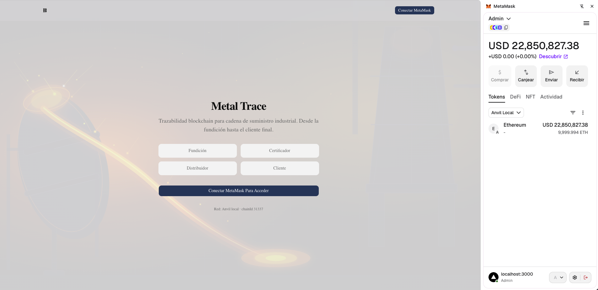 | Login / Conexión MetaMask |
| 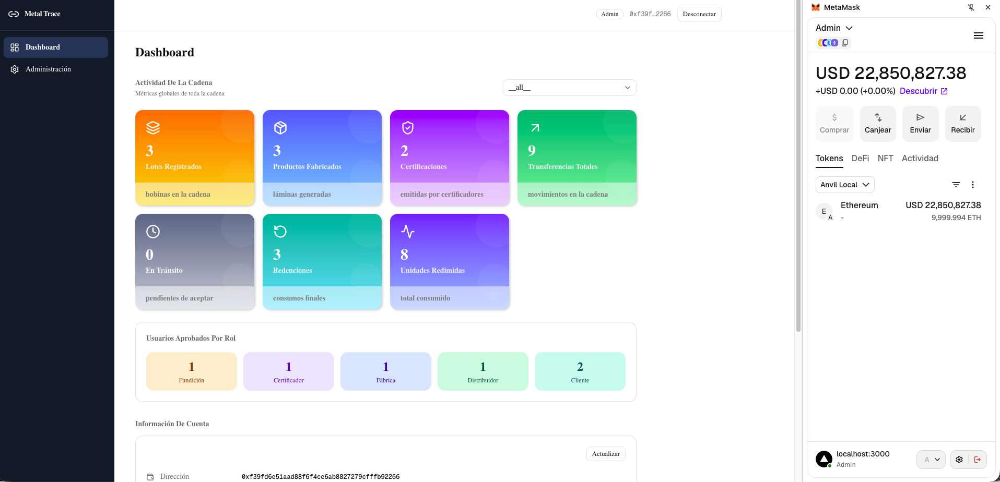 | Dashboard Administrador — KPIs globales |
| 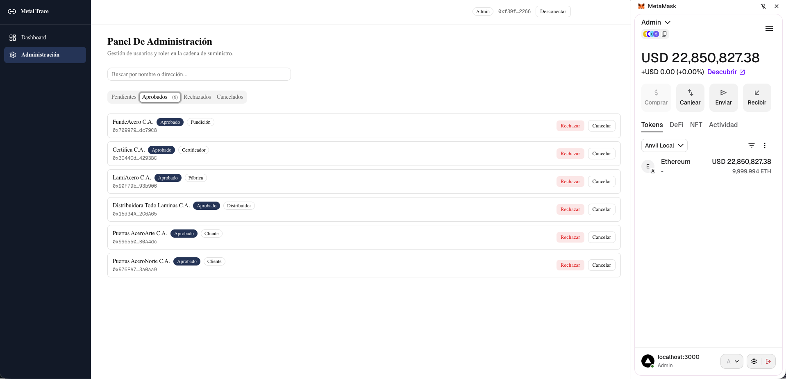 | Administración de usuarios |
| 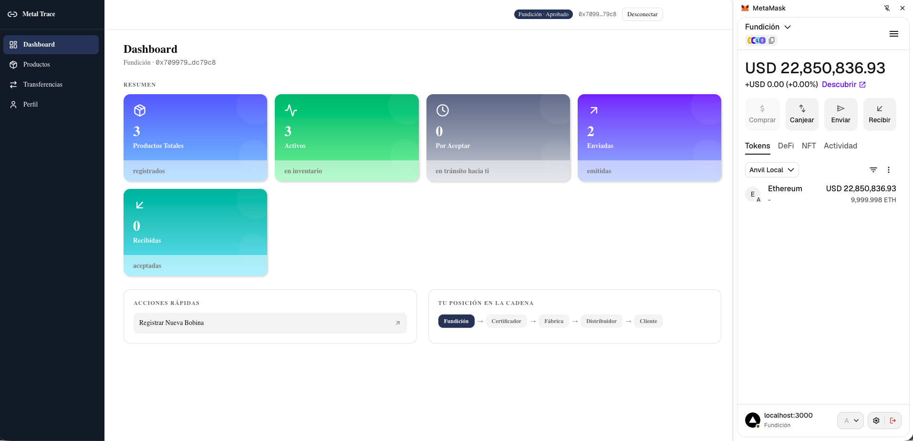 | Dashboard Fundición |
| 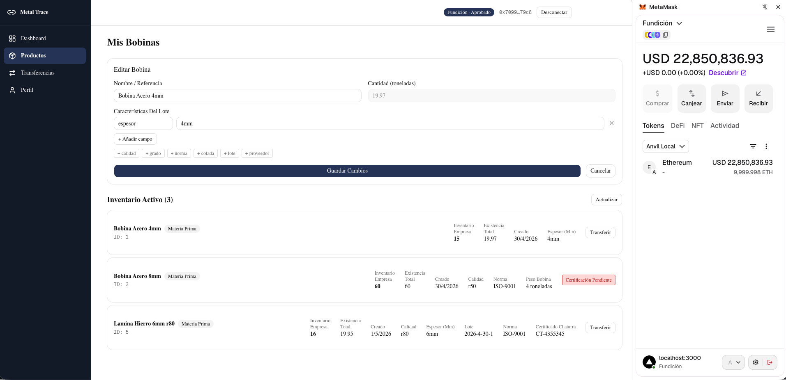 | Registro y lista de bobinas |
| 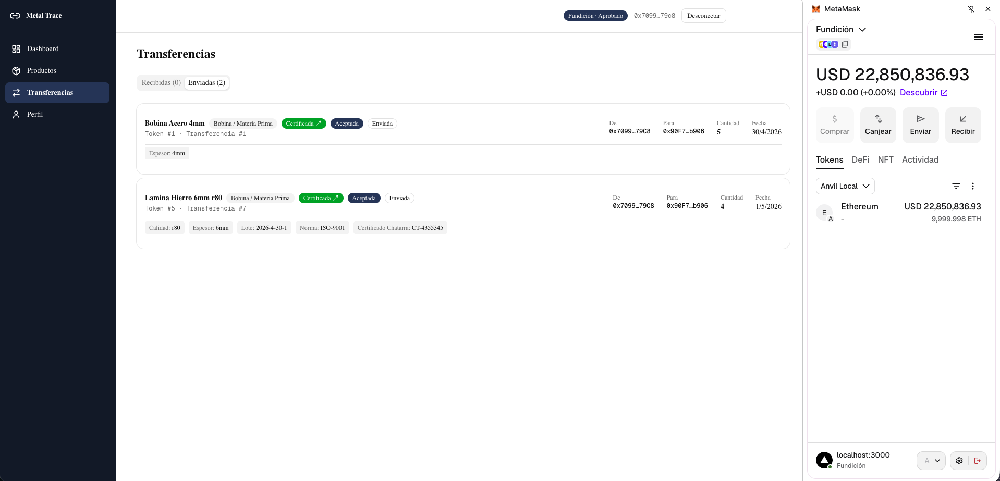 | Transferencias Fundición → Fábrica |
| 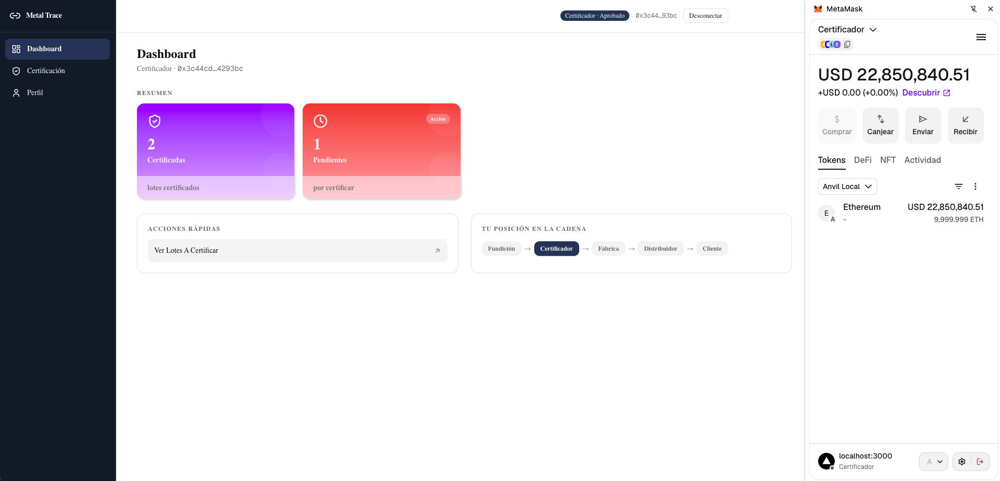 | Certificación de lotes |
| 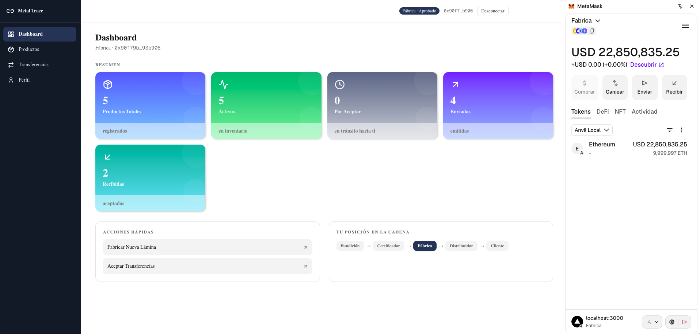 | Dashboard Fábrica |
| 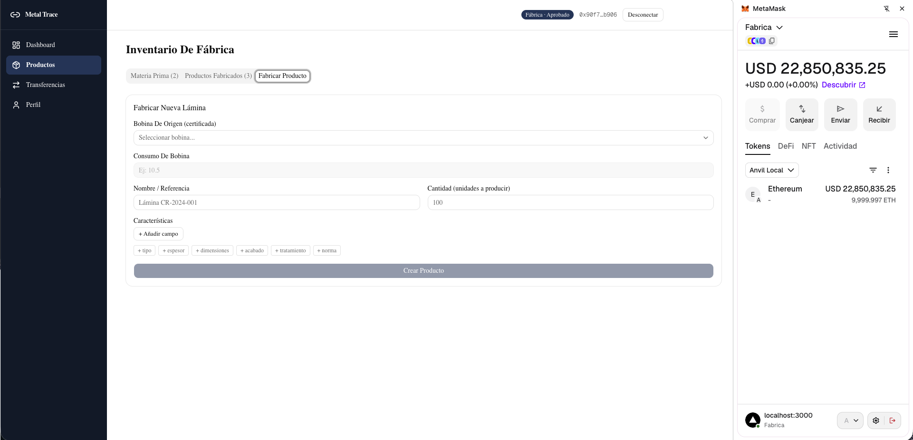 | Fabricación de productos |
| 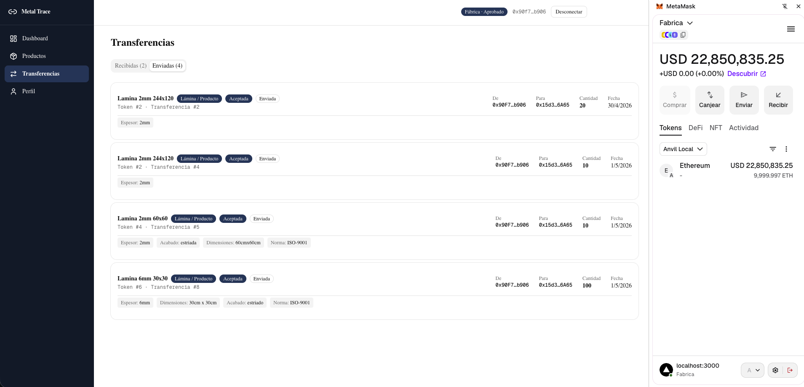 | Transferencias Fábrica → Distribuidor |
| 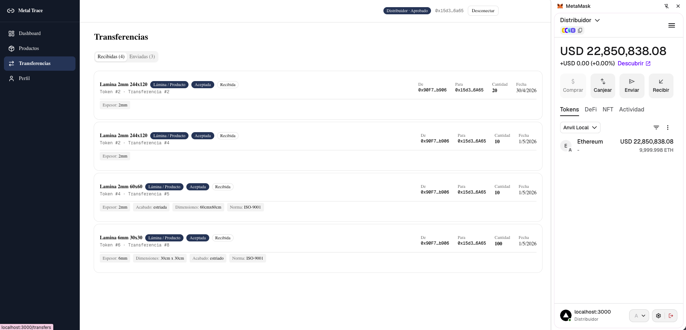 | Transferencias Distribuidor → Cliente |
| 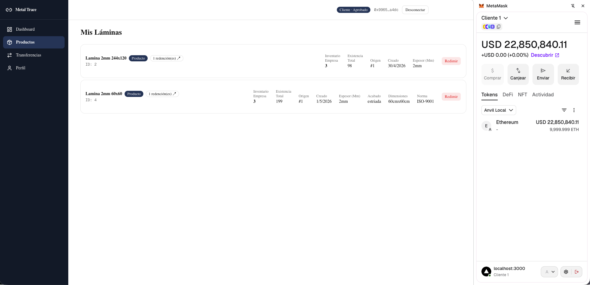 | Inventario Cliente |
| 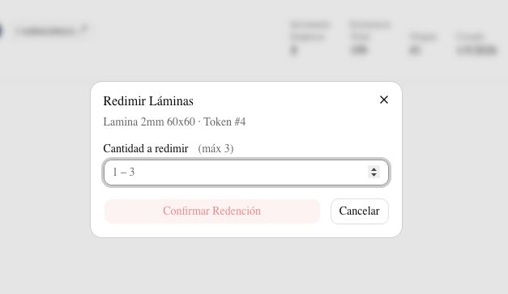 | Redención de productos |

---

## Cadena de valor

```
Fundición → Certificador → Fábrica → Distribuidor → Cliente
```

Cada actor opera con su propia wallet MetaMask. El contrato valida roles, permisos y la dirección correcta del flujo — no es posible saltarse un eslabón ni transferir en sentido inverso.

---

## Stack tecnológico

| Capa | Tecnología |
|---|---|
| Smart contract | Solidity ^0.8.19 |
| Testing y deploy | Foundry (forge, anvil, cast) |
| Frontend | Next.js 16 + TypeScript + Tailwind CSS + shadcn/ui |
| Integración Web3 | ethers.js v6 + MetaMask |
| Red local | Anvil (chainId 31337) |
| Herramientas IA | Claude Code + MCP Foundry Server |

---

## Estructura del proyecto

```
Supply-chain-tracker/
├── sc/                        # Smart contracts (Foundry)
│   ├── src/SupplyChain.sol    # Contrato principal
│   ├── script/Deploy.s.sol   # Script de despliegue
│   └── test/SupplyChain.t.sol # 56 tests unitarios
├── web/                       # Frontend Next.js 16
│   └── src/
│       ├── app/               # Rutas: dashboard, tokens, transfers, admin…
│       ├── components/        # UI por dominio (tokens, transfers, factory…)
│       ├── contexts/          # Web3Context — wallet, rol, contrato
│       ├── hooks/             # Lectura de datos on-chain
│       └── services/          # Web3Service — ethers.js v6
├── mcp-foundry/               # MCP Server — Foundry CLI para Claude
├── docs/
│   ├── diagramas.md           # Diagramas Mermaid de arquitectura
│   └── manual-usuario.md     # Manual de uso por rol
├── screenshots/               # Capturas de pantalla de la DApp
├── ModeloTeorico.md           # Arquitectura técnica completa
├── IA.md                      # Retrospectiva de uso de IA
├── redeploy.sh                # Script de redespliegue en Anvil
└── LICENSE
```

---

## Instalación y puesta en marcha

### Requisitos

- [Node.js](https://nodejs.org/) >= 18
- [Foundry](https://book.getfoundry.sh/getting-started/installation) (`forge`, `anvil`, `cast`)
- [MetaMask](https://metamask.io/) en el navegador

### 1. Clonar el repositorio

```bash
git clone <URL_DEL_REPO>
cd Supply-chain-tracker
```

### 2. Smart contract

```bash
cd sc
forge install          # instalar dependencias
forge build            # compilar
forge test             # ejecutar los 56 tests
```

### 3. Levantar la blockchain local

```bash
# En una terminal separada
anvil
```

### 4. Desplegar el contrato

```bash
# Desde la raíz del proyecto
# La primera clave privada de Anvil (Account #0) es el admin
./redeploy.sh 0xac0974bec39a17e36ba4a6b4d238ff944bacb478cbed5efcae784d7bf4f2ff80
```

El script compila, despliega, exporta el ABI y actualiza `web/.env.local` automáticamente.

### 5. Frontend

```bash
cd web
npm install
npm run dev
```

Abre [http://localhost:3000](http://localhost:3000) en el navegador.

### 6. Configurar MetaMask

1. Añadir red: RPC `http://localhost:8545`, Chain ID `31337`
2. Importar cuentas de Anvil usando sus claves privadas
3. Conectar la wallet de Admin (Account #0) para aprobar usuarios

---

## Tests

```bash
cd sc
forge test -vvv
```

```
Ran 56 tests for test/SupplyChain.t.sol:SupplyChainTest
56 passed | 0 failed | 0 skipped
Finished in 6.36ms
```

Cobertura de tests:

| Módulo | Tests |
|---|---|
| Gestión de usuarios | 9 |
| Índices de usuarios | 3 |
| Creación de tokens | 10 |
| Certificación | 7 |
| Consumo de materia prima | 6 |
| Transferencias | 7 |
| Validaciones y permisos | 7 |
| Casos edge | 5 |
| Eventos | 7 |
| Flujos completos | 3 |

---

## MCP Server — Foundry

El directorio `mcp-foundry/` contiene un servidor MCP que expone las herramientas de Foundry como funciones llamables por Claude:

| Herramienta | Descripción |
|---|---|
| `forge_build` | Compila los contratos |
| `forge_test` | Ejecuta la suite de tests |
| `forge_deploy` | Despliega con un script de Foundry |
| `anvil_start` | Inicia la blockchain local |
| `cast_call` | Llama a una función de lectura |
| `cast_send` | Envía una transacción firmada |

Ver instrucciones de instalación en [mcp-foundry/README.md](mcp-foundry/README.md).

---

## Decisiones de diseño del contrato

| Decisión | Razonamiento |
|---|---|
| `parentId == 0` distingue materia prima de producto terminado | Una sola regla permite al frontend separar inventarios sin lógica adicional en el contrato |
| Custom errors en lugar de `require` con strings | Menor gas por transacción; el bytecode no almacena los mensajes de error |
| Auto-mint al crear el token | Crear = tener el balance disponible de inmediato; no hay paso separado de mint |
| `burnToken` restringido al rol Consumer | El burn cierra la trazabilidad de forma definitiva; solo el destinatario final puede redimir |
| Escrow implícito en transferencias | El balance del emisor se descuenta al lanzar la transferencia; si el receptor rechaza, los tokens vuelven automáticamente |
| Índices auxiliares `_userTokenIds` y `_userTransferIds` | Solidity no permite iterar mappings; los arrays auxiliares permiten que el frontend construya los dashboards sin llamadas adicionales |
| Features como JSON string libre | Máxima flexibilidad para describir cualquier tipo de material o producto sin cambiar el contrato |

---

## Documentación

| Documento | Contenido |
|---|---|
| [ModeloTeorico.md](ModeloTeorico.md) | Arquitectura completa: roles, estructuras, flujos, eventos, errores |
| [docs/diagramas.md](docs/diagramas.md) | Diagramas Mermaid: ER, secuencias, estados |
| [docs/manual-usuario.md](docs/manual-usuario.md) | Manual de uso por rol |
| [IA.md](IA.md) | Retrospectiva del uso de IA: herramientas, tiempos, errores, sesiones |

---

## Cuentas de demostración (Sepolia testnet)

> ⚠️ **Aviso:** Estas cuentas son de uso exclusivo para la demostración de la DApp en Sepolia testnet. No deben utilizarse para ningún otro fin. No contienen ni deben recibir fondos reales.

### Configuración de red en MetaMask

| Campo | Valor |
|---|---|
| Red | Ethereum Sepolia |
| Chain ID | 11155111 |
| RPC URL | `https://sepolia.infura.io/v3/243c56f0553c417e97e7845c955e9073` |
| Explorador | `https://sepolia.etherscan.io` |

### Cuentas por rol

| Rol | Dirección | Clave Privada |
|---|---|---|
| **Admin** | `0x6098ABd349Fac2676c76e8804b19769CA916e565` | `d24470478bb67fd26f4a7c332ced696da88bb77ec8cbedf6ab5c7a4226316912` |
| **Fundición** | `0x0cdc0Df6e43b867C0c6a5128C83Bdb8E977caB4a` | `5d2cc681f4e1c2cb098aad5a8fd53d35a0e47f15f6293d4c3dae523ecdcedf7d` |
| **Certificador** | `0xE16dEB6C596C73Fd689d880De63cD1b4d8B37886` | `087869e308277df3ed649e6cb5fb0773c5490392bfc234dc87edda3a4ff38355` |
| **Fábrica** | `0x3C969F63b66B1e63Ed1ce0538BF3331326248EE1` | `5eb952793f8f8460b8e96d4505b06fcf931e159fb06c21f23ffc21675a602342` |
| **Distribuidor** | `0x795881A5292a980ebeb1e36B14Db703EE528CB8D` | `ffcab318acb5736980602c3965f75dc7e087571a05fe13a74a8cc8676f7c7244` |
| **Cliente** | `0xC097ec2A46563955519d2435Cc9c5F1d2c426163` | `56ad86cebf93b4b7b5f45e4b3e94143955b4d7211e4fa393107bc2661a776e25` |

### Pasos para importar en MetaMask

1. Abre MetaMask → menú **⋮** → **Importar cuenta**
2. Pega la clave privada del rol que quieras probar
3. Asegúrate de estar en la red **Sepolia**
4. Conecta en la DApp — si es la primera vez, solicita tu rol y espera aprobación del Admin

> El flujo completo requiere empezar por el **Admin** para aprobar a los demás usuarios antes de que puedan operar.

---

## Licencia

[MIT](LICENSE) — Rafael Rivas, 2026
