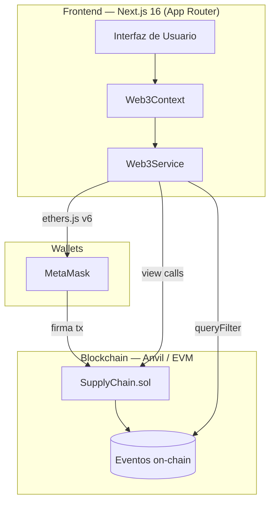
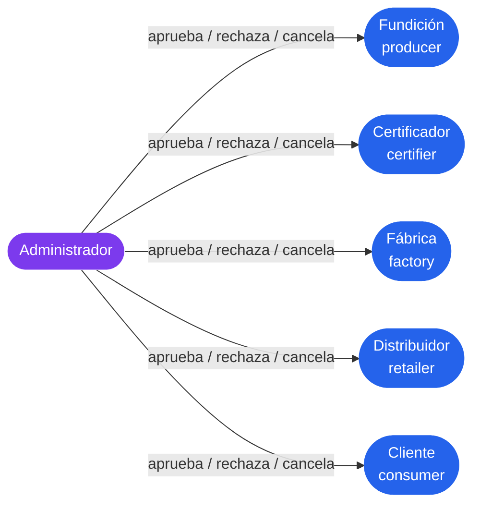
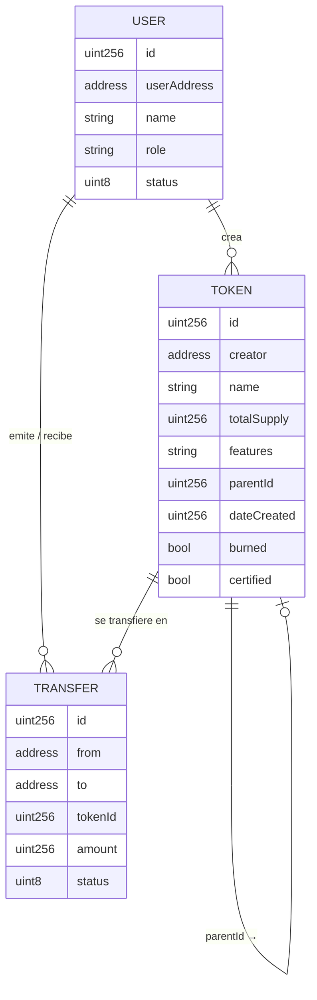
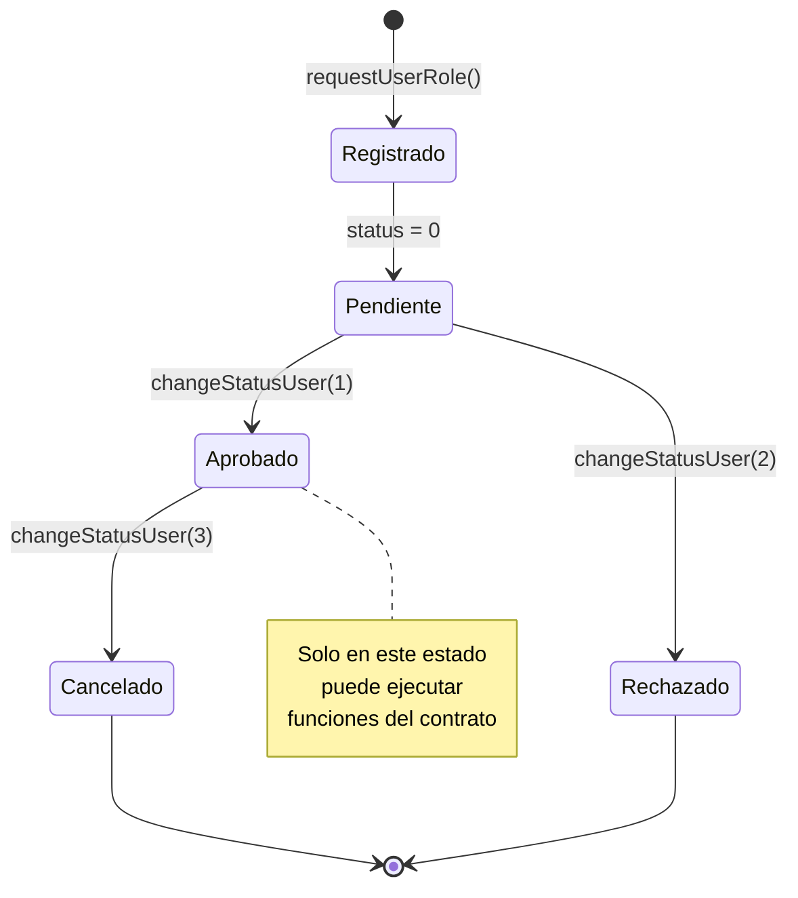
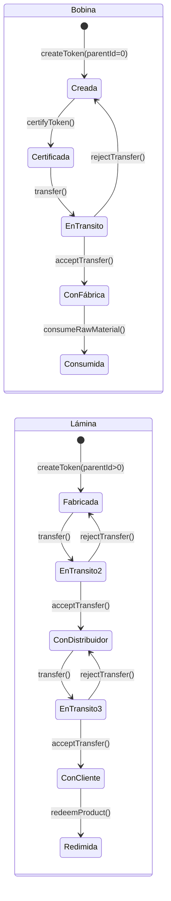
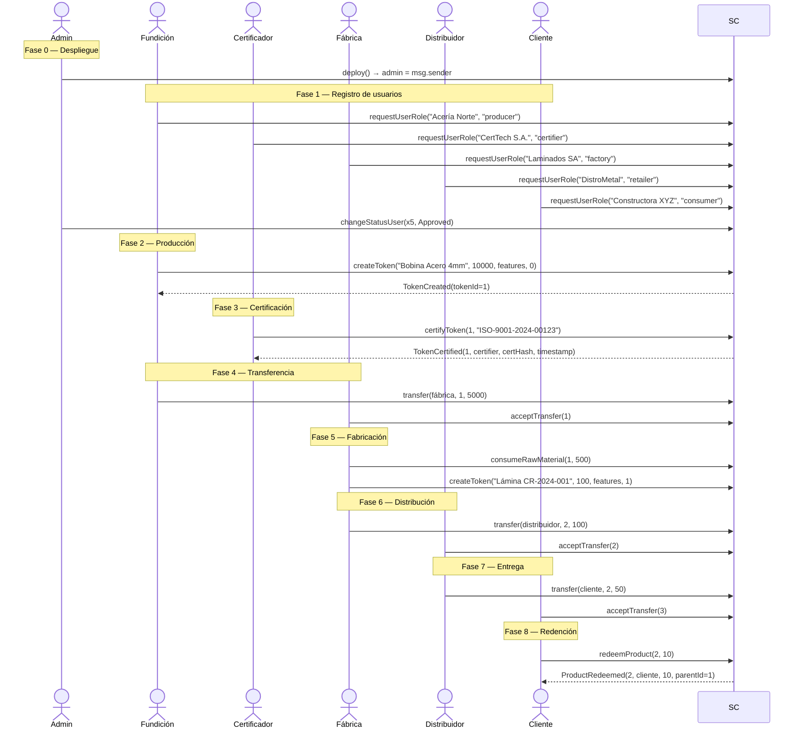
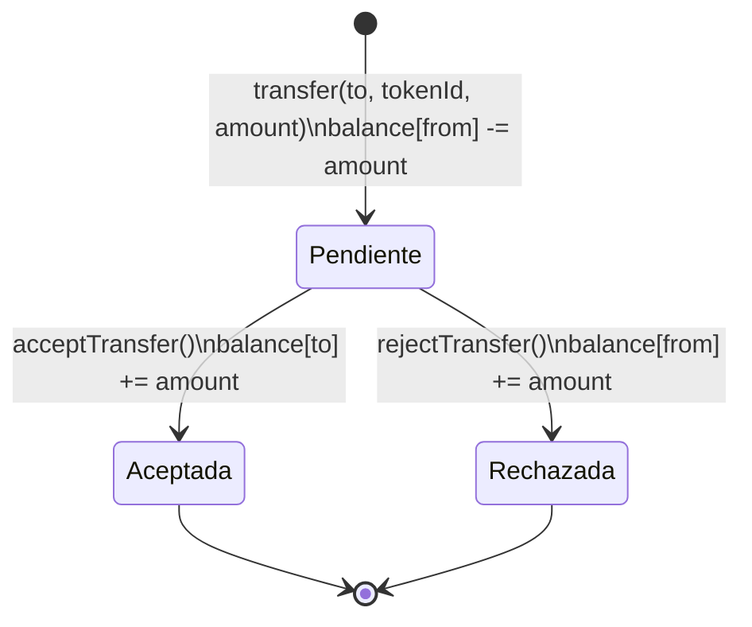
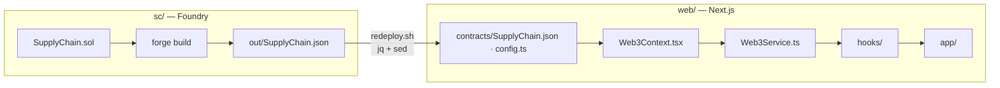

# Metal Trace — Diagramas de Arquitectura

## 1. Arquitectura general del sistema

---

## 2. Roles y permisos

---

## 3. Modelo de datos (ER)

---

## 4. Ciclo de vida del usuario

---

## 5. Ciclo de vida del token

---

## 6. Flujo completo de la cadena (secuencia)

---

## 7. Sistema de transferencias (estados)

---

## 8. Sincronización sc/ → web/

